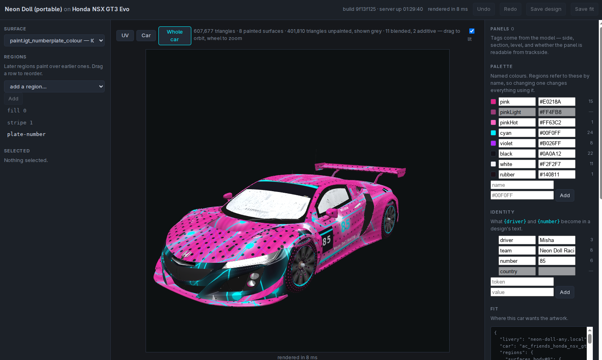

# liverykit

[](https://github.com/mishan/liverykit/actions/workflows/ci.yml)

Generate [Assetto Corsa](https://www.assettocorsa.net/) car liveries from code.



*The fitting editor: a design described as named regions over a palette, fitted onto the car's own model.*

```sh
# Linux:  sudo apt install imagemagick fonts-dejavu-core
# macOS:  brew install imagemagick
# Windows: imagemagick.org/script/download.php  (tick "Add to PATH")

npm install
node bin/liverykit.mjs neon-grid
# -> dist/neon_grid.zip — drag it onto Content Manager to install
```

Assetto Corsa 1 only. Competizione uses an unrelated skin system.

> The bundled example targets the RSS Formula RSS 4, a paid mod car. If you
> don't own it the build still works, you just can't install the result — skip
> to [Making a livery](#making-a-livery) and point it at a car you have.

---

## Why not just paint a texture?

Emitting a good-looking 2048×2048 image is the easy part. The hard part is that
**nothing in the texture tells you which bit of it lands on the sidepod.**

Coordinates in a texture are just fractions of an image. The mapping from those
fractions onto bodywork lives in the car's 3D model, and it is not evenly
spaced, not symmetric, and not guessable. Get it wrong and a sponsor name walks
off the edge of a *UV island* — a contiguous patch of texture that maps to one
region of bodywork — halfway through the word. Perfect in the texture, broken on
the car.

liverykit reads the car's model to find out. A `.kn5` (Assetto Corsa's model
format) stores a 3D position *and* a UV coordinate for every vertex, which is
precisely the mapping a livery needs.

<!-- TODO: an in-game screenshot of a built livery belongs here, and one of the
     calibration grid on bodywork further down. -->

---

## How it works

Four layers, deliberately separate:

| | what it describes | |
|---|---|---|
| **car profile** — `cars/*.json` | what a *car* is: its textures, and its UV islands given names and measurements | generated once per car, identical for everyone who owns it — **worth sharing** |
| **livery** — `liveries/*.mjs` | what a *design* is: palette, identity, and which **treatment** (a function that fills a rectangle with art) goes on which named **panel** (a named UV island) | quick to write, this is the fun part |
| **fit** — `fits/*.json` | where one design's artwork sits on one particular car | belongs to the pair, not to either half — see [below](#fitting-a-portable-design-to-one-car) |
| **pack** — `src/packs/*.mjs` | what a *style* is: the treatments themselves | bring your own without forking |

Because a livery names panels instead of coordinates:

```js
{ treatment: 'fill', panel: 'nose', at: [0, 0, 1, 0.4] }
```

reads *"the front 40% of the nose"* — and keeps meaning that if you point the
same design at a different car with `--profile`. Absolute coordinates still work
as an escape hatch for anything unmapped.

The editor makes that choice visible. A region can name **this car's panel** or
name **tags** — `left`, `mid` — and switch between them, with a live count of how
many panels the selection lands on. **On another car** then checks the whole
design against any other profile you have and names the regions that would find
nothing there. Neither needs a model or a game install: a profile is the whole of
what liverykit knows about a car.

### What the model tells you that a texture can't

Two things in a profile are worth knowing about up front, because both catch
people out and neither is recoverable from the texture alone.

**Which panels touch.** An unwrapper is free to place two panels that meet on the
bodywork at opposite corners of the texture. To a livery they look unrelated; on
the car, a stripe crossing between them has to line up. `adjacent` lists them —
on a typical open-wheeler there are around 190 such pairs, and the front and rear
halves of a single sidepod are routinely separate islands. Paint one and half the
pod stays stock.

**How big a panel is on the car.** Each measured panel records `metresPerUv`,
the world size of one unit of texture along each axis. `anisotropy` says a panel
is 3.9 times wider than tall in texture terms, which is what the renderer needs
to un-stretch a glyph; it cannot say whether that glyph lands 40 mm tall or 400,
because a ratio has no size in it. The editor shows the figure for whatever
region is selected. Profiles generated before this existed say *not measured*
rather than guessing — regenerate with `--from-kn5` to get it.

**Which panels are visible, and from where.** Being inside a UV island doesn't
mean anyone can see it — duct interiors, bulkhead backs and floor undersides are
all ordinary parts of an island. liverykit ray-casts against the whole car,
wheels and wings included, and reports `visible` per panel. On the example car
87 panels are completely unseeable from trackside.

Clicking a part the design does not paint names its texture and offers to take
it into the design — which is how you find out which of the four 1024-square
plate textures a GT3 car ships is the one on the door, without painting each in
turn to see which rectangle changes. It writes `paint.<role>`, addressing the texture
directly, because these surfaces have no binding and usually no panels: a banner
is too small a share of the car to survive the panel threshold. Normal maps and
shader maps are named but not offered, since painting one gives a car that loads
and lights wrongly.

The **Whole car** view shows every texture at once, with your design on the
surfaces it paints and the car's own artwork — read from your kn5, never shipped
— on the ones it does not. So what you are looking at is the car, not a livery
floating on a grey mannequin.

The stock artwork goes to the GPU as compressed blocks with no decoding step,
which means it covers DXT1, DXT3 and DXT5 — the great majority of what a car
ships — and nothing else. A PNG texture, an uncompressed DDS, or a browser
without `WEBGL_compressed_texture_s3tc` stays flat grey, as does an encrypted
car, whose embedded textures are 1×1 placeholders. Grey means *this part is not
yours and could not be shown*, never a guess at what belongs there.

It also reports `visibleFromCockpit`, cast from the driver's eye, and the two
disagree sharply: the flanks score 99% outside and 6% from the seat, the tub
interior the other way about. If you race in cockpit view, that second number is
the one that matters — and the surfaces you stare at all race are on entirely
separate textures from the bodywork, so an exterior-only livery leaves them
stock. `liveries/neon-grid.mjs` paints them.

---

## Install

```sh
npm install
```

Node 20.9 or newer — that is what sharp's prebuilt binaries require, so it is
the real floor rather than a preference. Two npm dependencies — `sharp`, which
ships prebuilt binaries so there's no build toolchain, and `colord`, which is 8 KB
and has none of its own — plus **ImageMagick on your PATH** — it's called as a
subprocess and works with either `magick` (IM7) or `convert` (IM6).

Text rendering needs a font the renderer can find. The examples use DejaVu Sans;
on Windows or macOS, change `render.font` in your livery to something installed
locally.

### You supply the game's files

This repository contains no car models, textures or skins, and never will: they
belong to the people who made the cars. What it ships are **profiles** —
measurements about a car, a few hundred lines of JSON each — which is why the two
bundled examples build without you owning anything.

Anything that has to read a car reads it from *your* installation:

| | needs |
|---|---|
| building a livery on a bundled profile | nothing |
| `--from-kn5`, `--explain` | the car's `.kn5`, path given explicitly |
| `--ui`, the 3D views | the car's `.kn5`, found or given |
| `--scan`, `--skins` | a `skins/` folder from the car |

Tell it where your install is once and the rest follows:

```sh
export AC_ROOT="$HOME/.steam/steam/steamapps/common/assettocorsa"
# Windows: C:\Program Files (x86)\Steam\steamapps\common\assettocorsa
```

`--ui` searches `$AC_ROOT`, then `$ASSETTOCORSA`, then this checkout under
`content/cars/<car>/` or `cars/<car>/` — so unpacking a car into the repo works
too, and both paths are gitignored. If it finds nothing it says so and lists
every path it tried; the UV editor still works without a model, and only the Car
tabs are unavailable.

*Developed and tested on Linux. The output is Windows-bound either way, since
that's where the game runs.*

---

## Making a livery

### 1. Generate a profile for your car

`<carId>` is the folder name under `content/cars/` — `ks_ferrari_488_gt3`,
`rss_formula_rss_4`, and so on.

```sh
node bin/liverykit.mjs --from-kn5 "$AC_ROOT/content/cars/<carId>/<carId>.kn5" \
                       --skins    "$AC_ROOT/content/cars/<carId>/skins" \
                       --car-id   <carId> --out cars/
```

Both paths are into *your* Assetto Corsa install — see
[You supply the game's files](#you-supply-the-games-files). Nothing here is
found for you: `--from-kn5` and `--explain` take a path and read exactly it.

`--skins` matters. The textures inside a kn5 are the model's own low-resolution
defaults — often 512×512 where the skins ship 2048×2048 — so real sizes are
cross-referenced from a skin folder. The model is authoritative about *layout*,
not about *resolution*.

The car's display name comes from `ui/ui_car.json` beside the model — the name
its author gave it, which is what Content Manager shows. `--car-name` overrides
it, and a name already in the profile survives regeneration.

Panels come out with systematic geometric names (`left_mid`, `centre_nose`).
Give the ones you care about friendlier names in the profile's `aliases` block,
which survives regeneration:

```json
"aliases": { "body": { "flankLeft": "left_mid", "nose": "centre_nose" } }
```

### 2. Start a livery

```sh
cp liveries/neon-grid.mjs liveries/my-livery.mjs
```

Then edit the three fields at the top:

```js
name:   'My Livery',
folder: 'my_livery',        // becomes skins/my_livery/ in the game
car:    'ks_ferrari_488_gt3',   // must match the profile's id
```

### 3. Prove the plumbing before making art

```sh
node bin/liverykit.mjs my-livery --flat
```

Solid colour, no artwork. Install it and check the car changes colour.

Do this first on every new car. If a filename is wrong the skin still installs
cleanly, logs nothing, and renders the stock car — which looks exactly like "my
livery didn't work" with no clue as to why.

### 4. Make it yours

[`liveries/neon-grid.mjs`](liveries/neon-grid.mjs) is commented as a tutorial —
palette, identity tokens, panel-relative coordinates and safe areas are all
explained inline. Then:

```sh
node bin/liverykit.mjs my-livery
```

### 5. Nudge it where it sits badly

Coordinates are a slow way to discover you were 3% off. `--ui` opens an editor
that shows the artwork on the texture *and* on the car, and writes what you drag
to a [fit](#the-fitting-editor) rather than to the design:

```sh
node bin/liverykit.mjs my-livery --ui
```

---

## Making a livery that works on more than one car

The problem: cars do not agree on anything. Across a 235-car survey the
generated texture role names came to 1,912 distinct names, 1,082 of which appear
on exactly one car. The bodywork is called `Skin_00.dds` on one model,
`SkinBase_DEFAULT.dds` on another, `paint.dds`, `LIVERY2.dds`, `cobrabody.dds`.
A livery that names files can only ever work on the car it was written against.

So a car profile carries a **binding** from a small fixed vocabulary onto
whatever that car happens to call things:

```jsonc
"bind": {
  "body":        { "roles": ["body", "bodyRear"], "source": "human" },
  "rims":        { "roles": ["rimFace"], "source": "human" },
  "numberPlate": { "roles": [], "source": "human" }   // this car has none
}
```

and a livery paints **surfaces** instead of files:

```js
surfaces: {
  body: {
    background: 'base',
    regions: [
      { treatment: 'traces', lanes: 22, color: 'accent' },
      // Panels are named per car, so select them by what they ARE. This renders
      // once per matching panel — 10 islands on one car, 12 on another.
      { treatment: 'piping', tags: ['left', 'visible'], color: 'accent' },
    ],
  },
}
```

Panels also carry a measured **`textRotation`**: how far the unwrapper laid the
panel from upright. A road car routinely turns a door sideways to pack its
texture sheet — the Abarth's doors measure 270° and 90°, the Formula 4's flanks
0° — so text placed without compensating reads vertically down the door. Write
`rotate: 'auto'` and artwork follows the panel. Near-horizontal panels like a
roof have no meaningful "up" and are left alone rather than turned by a number
derived from rounding error.

Tags available on every panel of a generated profile: `left` `right` `centre`,
`nose` `front` `mid` `rear` `tail`, `upper` `lower`, `visible` (readable from
trackside), `cockpit` (readable from the driver's seat), `mirrored`,
`shared`, and on the tyre texture `sidewall` and `tread`.

Tyres deserve a word. A sidewall is a disc, and an unwrapper lays it out either
as a disc — polar about a hub, the way a photograph of a wheel looks — or cut
once and rolled out as a strip, u round the circumference and v from rim to
shoulder. The Abarth's is a disc; the NSX's and the RSS4's are strips. A design
that draws rings is right on the first and draws one big circle across the
second, which on the car is a few stray arcs where the circle crosses the
strip. The profile measures which it is, from the wheel centres AC requires
every car to name, and writes it on the panel as `wheel`; the `band` treatment
reads that and draws a band round the tyre `along` the sidewall — 0 at the rim,
1 at the shoulder — whichever way it was unwrapped:

```js
tyres: { regions: [
  { treatment: 'band', tags: ['sidewall'], along: 0.9, width: 0.08, color: 'accent', glow: true },
] }
```

On a profile generated before this measurement existed there is no `sidewall`
tag and `band` draws as `ring` did; regenerate with `--from-kn5` to get it.

`shared` is the one that surprises people. A *part* is a thing on the car; a
*panel* is a region of a texture, and across a sample of eight cars 42.8% of
panels shared their rectangle with another — all four wheels drawn from one rim
texture, or mirrored bodywork where the left and right flank occupy the same
texels. Those panels claim no side, because they are on both, and tag selection
paints each rectangle once rather than once per part. So you cannot give the left
front wheel different artwork from the right rear, and the profile now says so
instead of letting you find out in-game.

`liveries/neon-grid-any.mjs` is the worked example. It has no `car` field at all,
so you choose one at build time:

```sh
node bin/liverykit.mjs neon-grid-any --profile cars/rss_formula_rss_4.json
node bin/liverykit.mjs neon-grid-any --profile cars/abarth500.json
```

Anything a given car lacks is **reported and skipped**, never silently dropped.

### Filling in the binding

`--from-kn5` proposes bindings automatically and marks them `source: "auto"`.
The proposal is right about 98% of the time, which is very good and is not the
same as trustworthy without looking, so confirm it:

```sh
# --explain takes a path; it never goes looking. Either from your install:
node bin/liverykit.mjs --explain "$AC_ROOT/content/cars/abarth500/abarth500.kn5" \
                       --skins   "$AC_ROOT/content/cars/abarth500/skins"
# or from a car unpacked into this checkout, which .gitignore already expects:
node bin/liverykit.mjs --explain cars/abarth500/abarth500.kn5 --skins cars/abarth500/skins
```

```
  role                    file                          area  seen  skins  sym  shader
  skinbase_default        SkinBase_DEFAULT.dds           37%   75%   90%  yes  ksPerPixelMultiMap_damage_di
  glass_2                 Glass.dds                       4%   94%    0%  yes  ksPerPixelReflection
  ...
  proposal: skinbase_default  (confidence 0.97, margin over runner-up)
```

Change the entry to `"source": "human"` once you agree. Regenerating the profile
preserves everything marked `human` and replaces everything marked `auto`, the
same way `aliases` are preserved.

### Fitting a portable design to one car

A portable design places its artwork on the largest visible panel of the right
side. That is the best a measurement can do — nothing in the tool knows which
PART of a panel is flat, or whether the middle of it wraps over a wheel arch.

A **fit** records the adjustment, and belongs to neither the design nor the car
but to the pair of them:

```jsonc
// fits/neon-grid-any@abarth500.json
{
  "livery": "neon-grid-any",
  "car": "abarth500",
  "regions": {
    "number-left": { "panel": "left_mid", "at": [0.24, 0.18, 0.52, 0.52] },
    "driver-left": { "drop": true }
  }
}
```

Picked up automatically as `fits/<livery>@<car>.json`, or passed with `--fit`.
Overrides are limited to placement (`panel`, `at`, `rotate`, `scale`, `safe`,
`drop`) because anything more and a fit becomes a second livery language. A fit
naming something that no longer exists is reported and ignored rather than fatal.

Give a region an `id` if you expect to adjust it. One without an id is still
addressable — by position, as `surfaces.body#3` or `paint.bodyRear#3` — but that
key means "whichever region is fourth", so inserting one above it silently moves
what the fit refers to. The editor labels those rows as addressed by position,
and the remedy is one line in the design.

### The fitting editor

Dragging rectangles in a text file, rebuilding, and installing to see where the
artwork landed is a slow way to find out you were 3% off. `--ui` opens a local
editor instead:

```sh
node bin/liverykit.mjs neon-grid-any --profile cars/abarth500.json --ui
# fitting editor at http://127.0.0.1:7391/
```

Drag a region to move it, drag a corner to resize, click a panel outline to send
it there. Every box you see is the rectangle the **renderer** resolved, not the
editor's own idea of where things are, so the two cannot quietly drift apart. The
re-render is a couple of milliseconds of JavaScript — no ImageMagick, no DDS
encode — which is the whole reason this is worth having.

Three views, because the sheet is not the question:

- **UV** — the texture, with panel outlines over it.
- **Car** — the same texture on the actual geometry. Whether a spot is flat, or
  faces the camera, or wraps over a wheel arch, is not visible on a flat sheet.
  You can drag on the car itself, and the artwork follows the surface.
- **Whole car** — every painted surface at once. A stripe can meet the bodywork
  perfectly and miss the sidepod beside it.

Both car views are **lit** — a hemisphere for sky and ground, one key light and a
clearcoat highlight — because an unlit slab cannot show how a stripe crosses a
curve. Shading distorts colour, though, so the **lit** tick turns it off when you
need to read the paint as it is. The UV view is always the honest one.

The Car views need the car's `.kn5`, which is yours and not shipped here — see
[You supply the game's files](#you-supply-the-games-files). The profile records
which model it was generated from, so setting `AC_ROOT` is usually enough; `--model`
overrides it. Without one the UV view still works and the tab says why.

Nothing is written until **Save fit**, which writes `fits/<livery>@<car>.json`.
Undo and redo (Ctrl/Cmd-Z, Shift-Ctrl/Cmd-Z) cover everything that changes the
fit, including creating and deleting regions.

**Symmetry.** Regions whose ids name a side — `number-left` and `number-right`,
or `numberLeft`/`numberRight` — are treated as two halves of one idea and move
together, mirrored rather than copied: two flanks are not always unwrapped the
same way round, and copying the coordinates across puts the artwork at the wrong
end of the car. You can unlink a pair, pair two regions the convention missed, or
mirror one onto the other once.

**Copies.** A fit may not add artwork, with one exception: it can say that an
existing region *also* appears somewhere else.

```jsonc
"copies": {
  "badge-mirror": { "of": "badge", "panel": "right_mid", "at": [0.3, 0.2, 0.2, 0.2] }
}
```

Treatment, colours and text all come from `of`; the only new information is a
placement, which is what a fit is for. It earns the exception because symmetry is
a property of the *car* — a design that paints one badge is portable to a car
with one flank worth painting and to a car with two, and the design cannot know
which it is being run against. **Create mirrored copy** and **Duplicate** in the
editor write these; the mirrored one measures where it should land from the
panels' own axes.

Full reasoning in [docs/fitting.md](docs/fitting.md). Turning the editor into
something that can create design elements rather than only move them is
planned in [docs/authoring.md](docs/authoring.md).

### What is wrong with it, measured

The editor shows you the car and you can judge whether it looks right. What you
cannot see, from any angle, is that a name is painted into the gap between two UV
islands and exists on no triangle at all — it renders perfectly on the sheet and
is simply not on the car. **Check the fit** in the right-hand panel measures that
and several other things:

| finding | what it means |
|---|---|
| `overlap` | two placements share space, and at least one is text |
| `crossed` | something is painted across a region that asked to be kept clear |
| `off-mesh` | the box lands on texture space no triangle uses |
| `unseen` | the bodywork hides it from trackside |
| `unreadable` | too small in millimetres at the car's real scale |
| `outside-safe` | outside the part of the panel measurement found readable |
| `unpainted-twin` | a sheet you paint has an unpainted duplicate on top of it |
| `bad-constraint` | a constraint nothing enforces — refused, not ignored |

The panel leads with what it could **not** check. "No findings" from a run that
skipped the geometry and "no findings" from a run that did all of it are the same
sentence and opposite facts, so the two are never allowed to look alike.

### One region across several panels

A rectangle lives in one island's sheet. A band that runs from the door onto
the panel behind it is one region with `span: true`, whose `at` may run past
its panel's edge:

```js
{ id: 'band', treatment: 'stripe', panel: 'left_mid', span: true,
  at: [-0.3, 0.62, 2.2, 0.10], color: 'white' }
```

The part past the edge is continued onto whichever adjacent islands it crosses
a seam into, through the seam maps the profile measured — drawn once, placed
under each panel's map, clipped to each panel's outline, so a stripe's edge and
a word's letters carry straight across. It stops where the bodywork does: on
the NSX a band across the door runs onto the fender strip ahead and the intake
surround behind, and not across the intake, because that is a hole. The
fitment check reports each piece where it lands (`band@left_rear_upper`).

The editor draws the home rectangle only and a drag stays inside the panel, so
for now a spanning region is written by hand or proposed over MCP.
[docs/spanning.md](docs/spanning.md) has the reasoning and the limits.

### Saying what a region needs

Placement rules say where artwork goes. Constraints say what it needs wherever it
ends up, and they live on the **design** so they travel to every car:

```jsonc
{ "id": "team-left", "treatment": "text", "text": "{team}",
  "constraints": { "keepClear": true, "minMm": 40, "minOnCar": 0.9 } }
```

`keepClear` closes a real gap: the overlap check speaks up for text on text,
because layering is how a livery is built — but a stripe running the length of a
flank is artwork by that measure, and the team name under it is still lost.
`minMm` replaces the global 25 mm floor for this region and applies to any
treatment. `minOnCar` does the same for how much of the box must land on
geometry, since a background fill is meant to bleed off an island and a name is
not. A misspelled constraint is refused rather than ignored: it would otherwise
read as a rule in force and enforce nothing.

### Surfaces the car should not draw

A GT3 car ships one set of number plate meshes per racing series and renders all
of them — this Honda has eight on the left flank alone, stacked in one patch of
door. Painting one leaves the others wearing their stock artwork on top of yours.
`hide` names the ones you are not using, by texture role:

```jsonc
"hide": ["imsa_numberplate_l", "blancpain_numberplate_silver_colour"]
```

A role the car does not have is ignored, because designs travel, and a surface
the design paints is never hidden.

In the editor a hidden surface is simply not drawn. In the game there is no such
switch, so the build ships a **fully transparent texture** for it — which works
when the part's material composites alpha, and not otherwise. The profile records
each texture's `shaders` so the build can tell, and it says which of four things
happened to every hidden role: shipped transparent; already hidden by the car's
own config; cannot be hidden this way (an opaque shader, or a size DDS cannot
carry), in which case the game will show it; or not on this car at all.

That "car's own config" is `extension/ext_config.ini` beside the model, where a
Custom Shaders Patch `MODEL_REPLACEMENT` can hide meshes — the usual arrangement
on cars converted from ACC is that every plate set is hidden there and a skin
un-hides one. `--from-kn5` reads it and writes `hiddenByCar` into the profile:
the meshes hidden, how each was matched, and any pattern that matched nothing.
A texture worn only by hidden meshes carries `hiddenByCar: true`; the editor
stops drawing it, the fitment check stops reporting it as an unpainted twin,
and a design that paints it is told so, since it is painting a part the game
never shows.

### Two honest limits

A fit adjusts placement, so two things it cannot rescue. A portable design cannot
use panel **names** in the design itself, only tags. And it cannot treat the roles behind one term
differently — if `body` binds to two textures, both get the same artwork, though
`once: true` will keep a car number on the primary one. Portable means coarser; a
design written for one car will always look better on it.

---

## Model Context Protocol (MCP)

`liverykit` includes a Model Context Protocol (MCP) server over stdio for AI pair programming and automated design workflows. The MCP server attaches to a **running editor instance** (`--ui`) and exposes tools for querying car profiles, reading working designs/fits, and submitting proposals to the editor's proposal inbox for human review.

### Starting the MCP Server

1. Start the fitting editor:
   ```sh
   node bin/liverykit.mjs neon-grid-any --profile cars/abarth500.json --ui
   ```

2. Connect an MCP client (such as Claude Desktop or an AI coding agent) by launching:
   ```sh
   node bin/liverykit.mjs --mcp
   ```
   If the editor is running on a non-default port, pass `--editor <url>`:
   ```sh
   node bin/liverykit.mjs --mcp --editor http://127.0.0.1:7391/
   ```

### Available MCP Tools

**Knowing.**

- **`describe_car`**: Profile metadata, texture roles, panel counts, bind table, and axes.
- **`find_panels`**: Query panels filtered by `role`, `tag`, `minVisibility`, `minArea`, `maxAnisotropy`, or `hasMirror`.
- **`list_treatments`**: Catalogue of all loaded treatment options and schemas.
- **`list_constraints`**: The constraints a region may declare, and what each enforces.
- **`read_design`**: Read working design data held in the running editor.
- **`read_fit`**: Read working fit overrides and copies, including stale region IDs.
- **`report`**: Detailed report of which surfaces and textures this design paints on this car.

**Measuring and seeing.**

- **`check_fitment`**: What is *wrong* with the working design on this car — text
  landing on text, artwork outside a panel's readable area, text too small at the
  car's real scale, broken mirroring, placements painted into texture space no
  triangle uses, and placements the bodywork hides. Read `notChecked`: it names
  checks that could not run, and an empty findings list from a partial run does
  not mean the design is good.
- **`render_view`**: Texture SVG and placement data for one surface, or all of them.
- **`render_car`**: A picture of the working design on the car, returned as an
  image. Seven named views. Its limits are in the tool description rather than
  left to be discovered: no transparency, no stock car textures — unpainted parts
  are flat grey — and one fixed light rig.

**Proposing.**

- **`propose_design`**: Propose design changes (palette, regions, options, identity, constraints) to the editor's inbox.
- **`propose_fit`**: Propose fit placement overrides or copies to the editor's inbox.

Proposals land in the editor's proposal banner (`#proposal-banner`) where the human user can visually inspect, drag, and **Accept** or **Discard** them using the undo stack. The MCP server never writes directly to disk.

See [docs/mcp.md](docs/mcp.md) for full protocol details and design rationale.

---

## Writing your own treatments

A treatment takes a rectangle and returns SVG. Anything it puts in `emissive` is
rendered separately, blurred and screened back on to produce a glow.

```js
// my-pack.mjs
import { definePack, registerPack } from 'liverykit';

registerPack(definePack('my-team', {
  chevron: (rect, ctx) => ({
    base: `<path d="M${rect.x} ${rect.y} ..." fill="${ctx.color('accent')}"/>`,
    emissive: '',
  }),
}));
```

```sh
node bin/liverykit.mjs my-livery --pack ./my-pack.mjs
```

**On values from a livery.** Every string `ctx` hands you — `ctx.color(...)`,
`ctx.opts.*`, `ctx.palette`, `ctx.tokens` — is escaped for an ATTRIBUTE before
your treatment sees it, so interpolating one into `fill="…"` is safe: it cannot
close the quote and become markup. `ctx.opts.text` is the single exception. It
is content rather than a parameter, and arrives raw so that it can be escaped
for the text node you put it in — `core`'s `text` does that with `esc`, and
`radialText` does it a character at a time. If you put `text` anywhere other
than between two tags, escape it yourself.

Then list `'my-team'` in the livery's `packs`. `--pack` is repeatable and loads
before the livery, so the names are registered by the time it needs them.
[`src/packs/synthwave.mjs`](src/packs/synthwave.mjs) is the worked example;
`core` holds the primitives and no house style.

Two notes on the registry: it's module-global, so two copies of liverykit in one
dependency tree get two of them; and `liverykit/packs/*` subpath imports hand you
the pack *object* without registering it — import `liverykit` itself for the
built-ins.

---

## Car profile reference

Per panel:

| field | |
|---|---|
| `rect` | the UV island's bounds — `[x, y, w, h]` as fractions of the texture |
| `anisotropy` | how much wider than tall a square of texture lands on the bodywork. The `text` treatment cancels it for you |
| `mirrorOf` | the matching panel on the other side of the car, if there is one |
| `adjacent` | panels that physically touch this one on the car |
| `wheel` | on a tyre part: `part` (sidewall or tread), `unwrap` (strip or annulus), `radiusM` [rim, shoulder]; for a strip `around` (which coordinate runs round the circumference), `rim` (which panel edge is the rim) and `across` [at rim, at shoulder]; for an annulus `hub` and `radiusUv`. `fit` is the correlation the verdict rests on |
| `seams` | for each adjacent panel, the affine `matrix` from this sheet to its sheet, fitted in metres from the vertices they share; `here` is where the seam sits in this sheet, `points` and `rmsMm` how much the fit rests on and how far it misses. See [docs/spanning.md](docs/spanning.md) |
| `outline` | the island's boundary polygon in sheet fractions, on panels with seams — a `rect` is a box and islands are not |
| `visible` | fraction of the panel readable from trackside |
| `visibleFromCockpit` | the same, cast from the driver's eye — inverts the answer for interior surfaces |
| `safe` | the sub-rect that's actually visible, when smaller than `rect` |
| `tiled` | the UVs run past 0..1 because the texture repeats, so `rect` is clamped and panel-relative coordinates mean little |
| `uvBounds` | present only when `tiled`: the true UV extent, before clamping |
| `confidence` | `measured` if derived from a model, `estimated` if a human filled it in |

Top level: `textures` (role → file, size, alpha), `aliases`, `caseCollisions`,
and two different "don't paint this" lists:

- **`doNotPaint`** — textures the model binds as something other than colour:
  normal maps, shader maps, dirt masks. Painting one corrupts the thing it
  encodes.
- **`leaveStock`** — textures that genuinely *are* colour maps and will happily
  accept artwork, but shouldn't get it: baked shadow overlays, mirror surfaces,
  motion-blur variants, and the car maker's own badges. Each entry says why.

---

## Commands

Run from a clone with `node bin/liverykit.mjs`, or `npm link` once if you'd
rather type `liverykit`. `--help` is authoritative.

```
<livery>                          build + ZIP
<livery> --flat                   solid colour, no art — the smoke test
<livery> --seed hotline-07        re-roll all procedural placement
<livery> --size 4096              render bigger (powers of two only)
<livery> --keep-png               keep intermediate PNGs, written beside the skin
<livery> --no-zip                 folder only
<livery> --profile <path>         use a different car profile — how you port a
                                  design between cars
<livery> --fit <path>             per-car placement overrides for this design
                                  (default: fits/<livery>@<car>.json, if present)
<livery> --ui                     open the fitting editor instead of building
  --model <car>.kn5                 model for the editor's 3D views; defaults to
                                    the one the profile was generated from
  --port 7391                       where to serve it (loopback only)
<livery> --pack ./my-pack.mjs     load an extra treatment pack (repeatable)
<livery> --uvgrid                 build a calibration skin (see below)
<livery> --uvgrid --cells 40      finer grid, for small parts
<livery> --uvgrid --probe a,b,c   ship candidate filenames as colour-coded probes
--from-kn5 <car>.kn5              generate a car profile from the model
  --skins <dir>                     cross-reference real texture sizes
  --car-id <id> --car-name <name>
--explain <car>.kn5               rank which texture is the bodywork, with the
                                  evidence, so you can confirm the binding
  --term rims                       explain a different vocabulary term
  --no-visibility                   skip the ray casting: faster, less accurate
--scan <skins dir>                classify textures without a model
--mcp                             start the MCP stdio protocol server (attaches to running --ui)
  --editor <url>                    editor URL for --mcp (default: http://127.0.0.1:7391/)
--out <dir>                       output directory (default: dist)
```

`npm run build` builds the bundled `neon-grid` example; `npm test` runs the
suite.

---

## Name probes

AC resolves a skin override against texture names inside the model, **not**
against whatever the stock skins happen to contain. A texture missing from every
skin folder tells you nothing about whether the car has it — which is how parts
get written off as unpaintable when they aren't.

If you have the model, `--from-kn5` lists every texture and this problem
disappears. If you don't, guessing is free: a filename that matches nothing
overrides nothing, silently and harmlessly.

```sh
node bin/liverykit.mjs my-livery --uvgrid --probe Tire_D.dds,Tire.dds,tyres_all.dds
```

Each candidate ships in a loud colour with its own filename printed on it. One
look at the car identifies the winner; the rest are inert. The probes also draw
concentric rings, so if the part turns out to be radially unwrapped — as tyre
sidewalls usually are — you learn the layout at the same time as the name.

---

## The calibration skin (optional)

`--uvgrid` paints every texture as a labelled coordinate system — columns A–T,
rows 1–20 — then you install it, photograph the car, and read panel positions
straight off the bodywork.

**Most people can skip this.** `--from-kn5` supersedes it for panel positions,
anisotropy, mirroring and visibility. It's still the answer when:

- **The model is encrypted.** Some mod cars ship kn5s the reader can't open.
- **You're mapping the driver or pit crew.** Those are separate models under
  `content/driver/`. Point `--from-kn5` at them too, or estimate and mark the
  panels `"estimated"`.
- **You want to check a profile against reality.** You parsed one file; the game
  loads whatever is installed. `--flat` catches *nothing overrode*; the grid
  catches *overrode the wrong thing*.

Full procedure in [docs/calibration.md](docs/calibration.md).

---

## Contributing

Car profiles are the most valuable thing to contribute: one command produces one,
and it's identical for everyone who owns that car. See
[CONTRIBUTING.md](CONTRIBUTING.md), and [AGENTS.md](AGENTS.md) for how the code
is arranged and the Assetto Corsa behaviours it is defending against — every one
of which produces a file that installs cleanly and is wrong.

The kn5 reader is reverse-engineered from a format with no public specification.
It validates by consuming the file to its exact final byte, so a wrong layout
fails loudly instead of parsing into nonsense. If it throws on your car, please
[open an issue](https://github.com/mishan/liverykit/issues) with the version
number it prints.

## Licence

MIT. Not affiliated with Kunos Simulazioni or any car maker. Ships no game
assets, and profiles contain measurements only — never textures or models.
